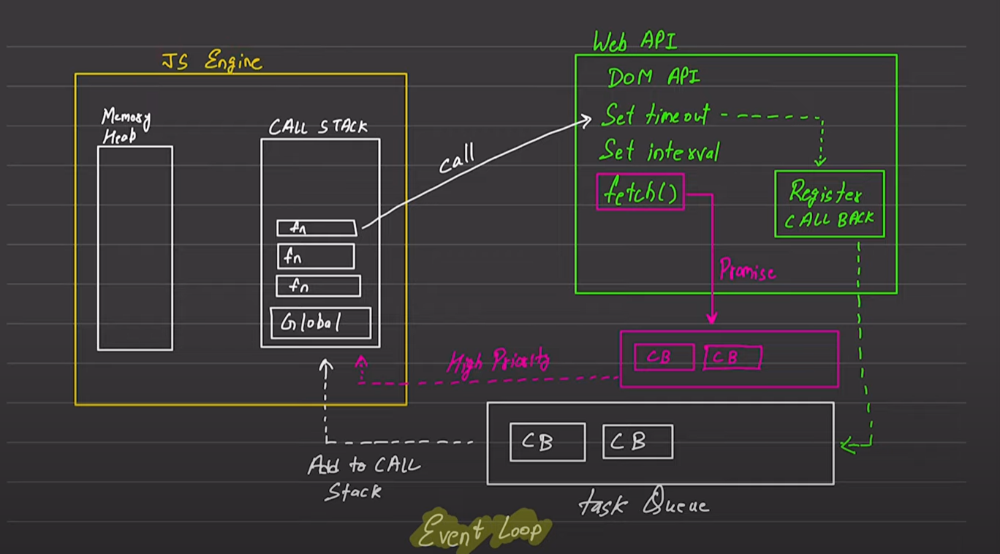

# JAVASCRIPT Nature

**DEFAULT** Javascript behaviour is **Synchronous** and **Single Threaded** Language

## Exceution Context

- Execute one line of code at a time
- Each operation waits for last one to complete before executing

## Javascript Event Loop

JS Engine has two componenets

- Memory Heap - stores variables, functions etc
- Call Stack - recordes which function is to be executed
  

JS engine work along with Web APi(Provided by browser) /Environment (example node)

**TASK QUEUE** is what makes javascript faster.

**High PRIORITY QUEUE** is what stores promises

Whenever a program is executed a call stack is created and functions are loaded in call stack one by one in order of their appearance and are removed from stack once finshed executing.

To write **ASYNC** code js engine works with webapi/node-env

Example - When a function x() invokes setTimeout() provided by WebAPI , x()
is removed from stack and next function is executed , meanwhile setTimeout waits for timeout to end then regsiters callback function to task queue which then adds it back to JS engine call stack for execution.
